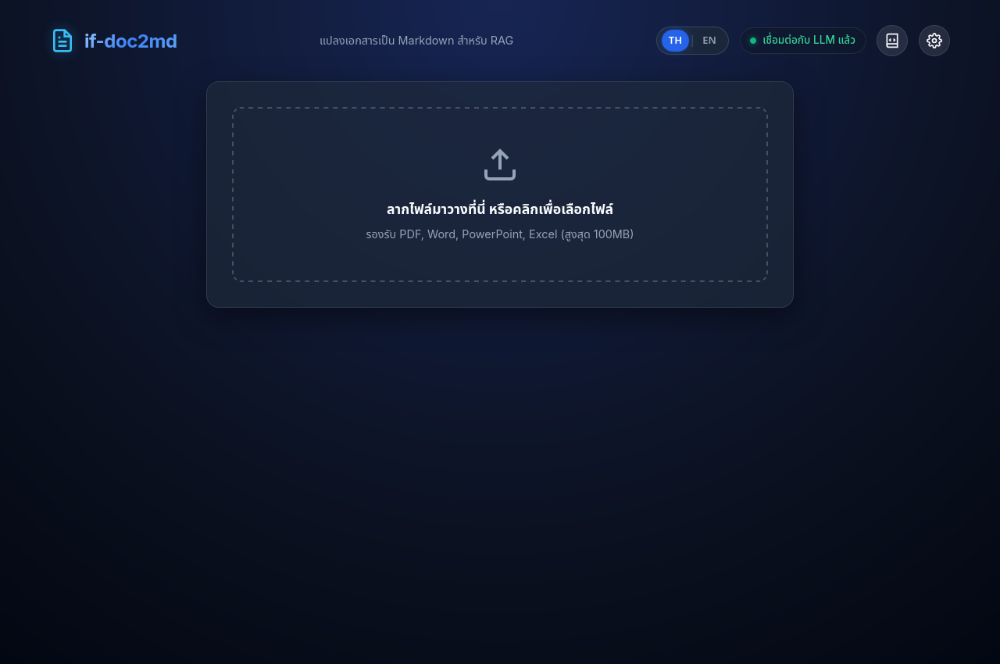
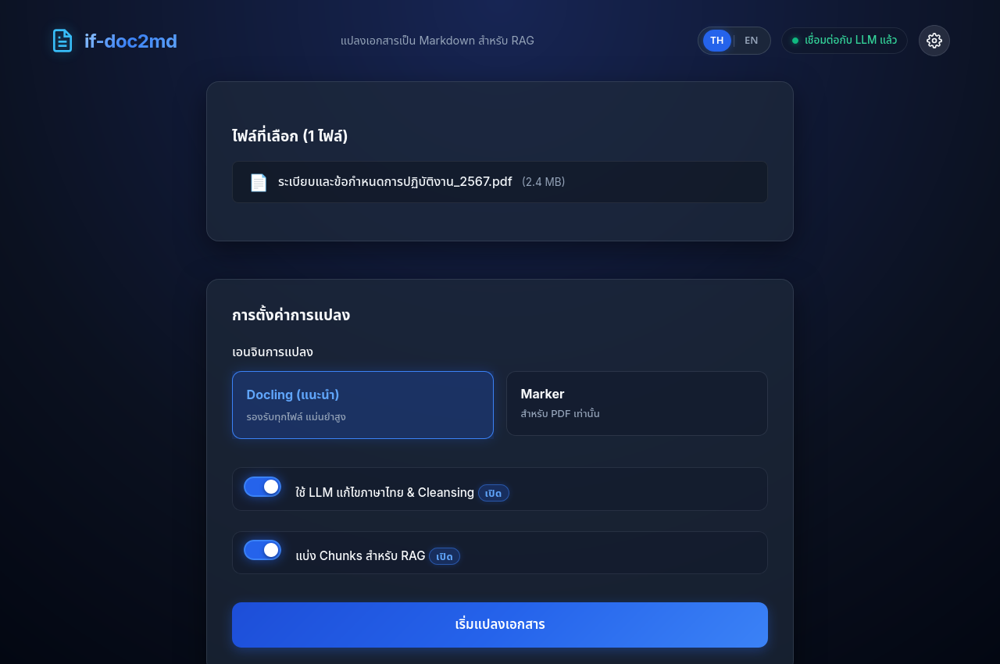
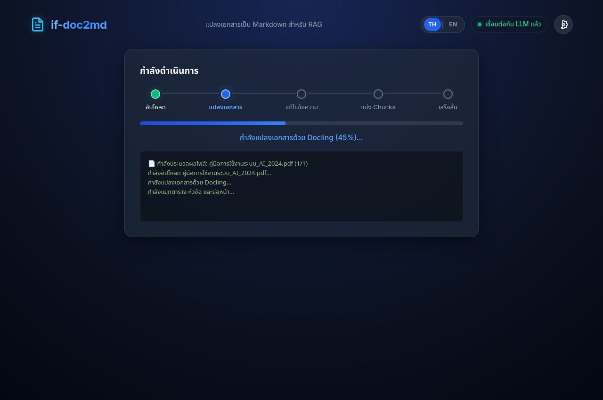
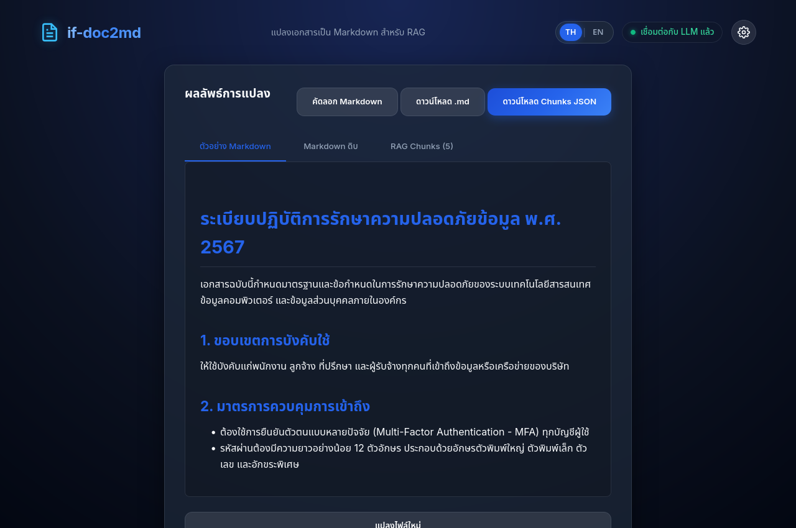
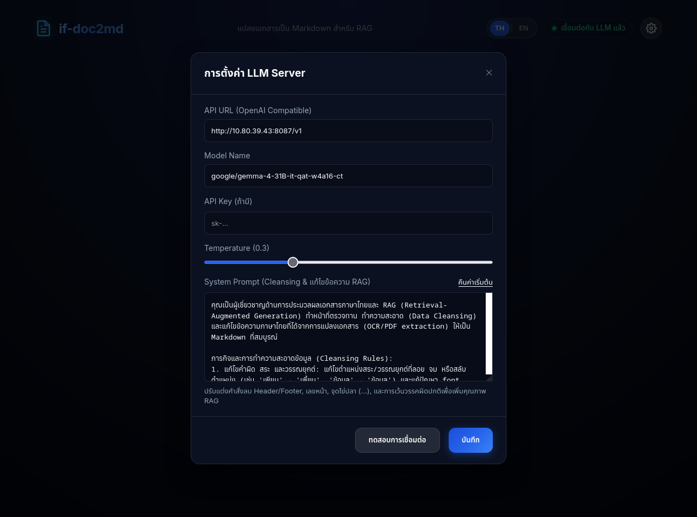
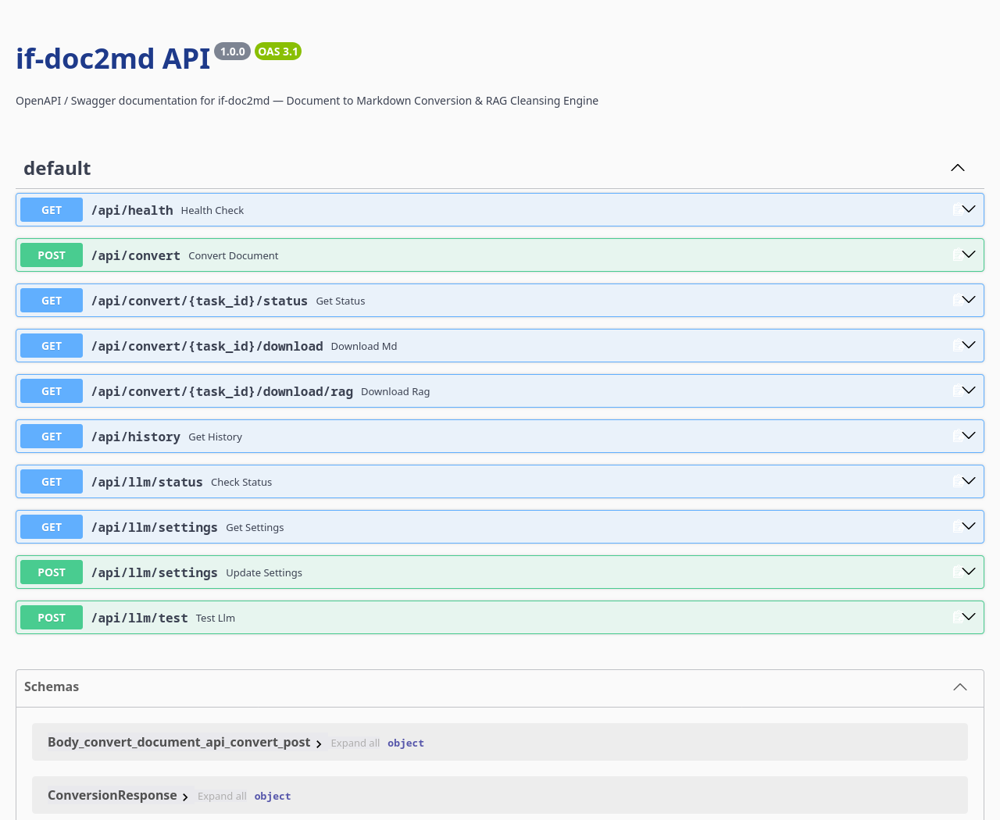

# if-doc2md 📄→📝

> **ระบบแปลงเอกสารเป็น Markdown สำหรับ RAG พร้อมทำความสะอาดข้อมูล (Data Cleansing) ด้วย Local LLM**  
> Convert PDF, Word, PowerPoint, and Excel files to RAG-ready Markdown using **Docling**, **Marker**, and **Local LLM** with custom data cleansing prompts.

[🇹🇭 อ่านคู่มือภาษาไทย](README.th.md) | [🇬🇧 English Documentation](README.en.md)

[](https://github.com/jirayusgoodlife/AI-PDF-to-MD)
[](https://hub.docker.com/r/jirayusgoodlife/ai-pdf-to-md)


---

## 📸 ตัวอย่างหน้าจอระบบ / UI Showcase

### 1. หน้าจอหลักและการอัปโหลด (Main Interface)
หน้าจอ Drag & Drop สไตล์ Dark Slate & Electric Blue พร้อมตัวสลับภาษา (TH / EN) และสถานะเชื่อมต่อ LLM แบบเรียลไทม์


### 2. ตัวเลือกการแปลงเอกสาร (Conversion Options)
เลือกเอนจินการแปลง (Docling / Marker), เปิด-ปิดระบบ LLM Thai Text Correction & Cleansing, และระบบแบ่ง Chunks สำหรับ RAG


### 3. แถบแสดงขั้นตอนแบบเรียลไทม์ (Live Step Progress)
ติดตามสถานะการประมวลผลทีละขั้นตอน (อัปโหลด → แปลงเอกสาร → แก้ไขข้อความ → แบ่ง Chunks → เสร็จสิ้น) พร้อมไฟสถานะ Glowing Dot และแถบเปอร์เซ็นต์


### 4. ผลลัพธ์การแปลงและ RAG Chunks (Preview & Export)
แสดงตัวอย่าง Markdown ที่จัดรูปแบบสมบูรณ์, Markdown ดิบสำหรับคัดลอก และ RAG Chunks JSON พร้อมดาวน์โหลด


### 5. ปรับแต่ง System Prompt ในการตั้งค่า (Custom System Prompt & RAG Cleansing)
ปรับแต่ง URL, Model, Temperature และแก้ไขคำสั่ง **System Prompt** เพื่อทำความสะอาดข้อมูลที่ไม่จำเป็นต่อ RAG (ลบ Header/Footer, เลขหน้า, จุดไข่ปลา `.....`, และเว้นวรรคผิดปกติ) พร้อมปุ่ม "คืนค่าเริ่มต้น"


### 6. เอกสาร API แบบโต้ตอบ (Interactive OpenAPI / Swagger UI)
เปิดดูและทดสอบ API ได้โดยตรงผ่านปุ่มในหน้าเว็บ หรือเข้าผ่าน `/docs`, `/swagger`, `/api/docs` (รองรับการทำงานแบบ Offline ในตัว)


---

## ✨ คุณสมบัติเด่น / Key Features

- 🎨 **Modern Dark Slate & Electric Blue UI**: ดีไซน์กระจกโปร่งแสง (Glassmorphism) รองรับ 2 ภาษา (🇹🇭 TH / 🇬🇧 EN) สลับได้ทันที
- 📄 **Multi-Format & Scanned Image Support**: รองรับ PDF, Word (.docx), PowerPoint (.pptx), Excel (.xlsx) รวมถึงไฟล์รูปภาพสแกน/ถ่ายเอกสาร (.png, .jpg, .jpeg, .webp, .tiff, .bmp) สูงสุด 100MB
- 🔍 **Scanned PDF & Photocopy OCR (Thai + English)**: สกัดข้อความจาก PDF ที่เป็นภาพสแกนหรือเอกสารสำเนาถ่ายเอกสารได้อย่างแม่นยำด้วย Tesseract OCR (`tha` + `eng`) พร้อมระบบ Auto-detect Scanned PDF และจัดระเบียบสระ/วรรณยุกต์/ช่องว่างภาษาไทย
- 🔧 **Dual Conversion Engines**:
  - **Docling (IBM)** — รองรับทุกประเภทเอกสาร, OCR ในตัว, ดึงตารางและโครงสร้างได้แม่นยำสูง
  - **Marker (Datalab)** — ผู้เชี่ยวชาญเฉพาะทางสำหรับไฟล์ PDF ความเร็วสูง
- 🧹 **AI Thai Correction & RAG Data Cleansing**:
  - 🗑️ **กำจัดขยะ RAG**: ตัด Header, Footer, เลขหน้าซ้ำๆ ("หน้า 1 จาก 10", "Page 1 of 5")
  - ✂️ **ลบจุดไข่ปลา/เส้นประ**: จัดการ `...............`, `-------------`, `_ _ _ _ _` ที่พบในแบบฟอร์มหรือสารบัญ
  - 🔤 **จัดระเบียบการเว้นวรรค (Spacing Normalization)**: แก้ไขคำภาษาไทยที่ตัวอักษรกระจายจากการจัดหน้าแบบ Justify (`ก า ร ท ด ส อ บ` → `การทดสอบ`)
  - ✍️ **แก้คำผิด OCR**: แก้สระลอย สระจม วรรณยุกต์ และ font encoding เพี้ยน
- ⚙️ **Customizable System Prompt**: ปรับแก้ข้อความคำสั่ง Prompt ได้เองตามต้องการในหน้า Setting พร้อมปุ่มรีเซ็ต
- 📦 **Hierarchical RAG Chunking**: แบ่งเนื้อหาเป็นส่วนๆ ตามลำดับชั้นหัวข้อ (Heading Level) พร้อมเก็บ Metadata ครบถ้วน (heading_path, source, chunk_index)
- 🐳 **Docker Ready**: ติดตั้งและใช้งานง่ายผ่าน Docker Image หรือ Docker Compose เพียงคำสั่งเดียว

---

## ⚡ Quick Start / เริ่มต้นใช้งานรวดเร็ว

### ดึง Image จาก Docker Hub และเปิดใช้งานทันที
```bash
# 1. ดึง Image ล่าสุด
docker pull jirayusgoodlife/ai-pdf-to-md:latest

# 2. รันแอปพลิเคชัน
docker run -d -p 8000:8000 \
  -v ./outputs:/app/outputs \
  -v ./uploads:/app/uploads \
  --name if-doc2md \
  jirayusgoodlife/ai-pdf-to-md:latest
```

### รันด้วย Docker Compose (All-in-One พร้อม Local LLM Ollama)
```bash
docker compose up -d
```

เปิดเบราว์เซอร์ไปที่: **http://localhost:8000**

---

## 📚 เอกสารคู่มือฉบับเต็ม / Documentation Links

- 🇹🇭 **[คู่มือการใช้งานภาษาไทย (README.th.md)](README.th.md)** — อธิบายการตั้งค่า Local LLM (Ollama / vLLM / LM Studio) และเทคนิคการ Cleansing ละเอียด
- 🇬🇧 **[English Documentation (README.en.md)](README.en.md)** — Complete guide in English including API documentation and RAG architecture.
